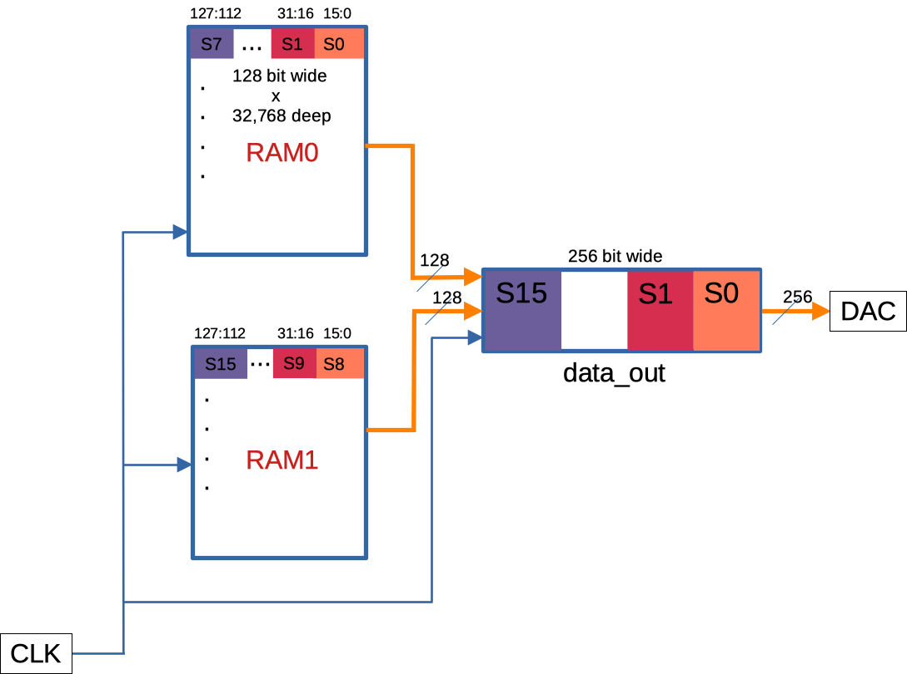

# awg-rfsoc
## An arbitrary waveform generator (AWG) with the Real Digital RFSoC board. 

The FPGA on the device can be loaded with $2^{19}$ points and it can generate arbitrary waveform at a sampling rate of 9.34 GSps.  
An example jupyter notebook is included that demonstrates how the AWG can be programmed. 
The <i>srcs</i> folder contains the verilog code to realize the arbitrary generator block, a constraint file used for synthesis and implementation as well as the block diagram of the design.  
To use it copy the Jupyter notebook <i>arb_with_rfsoc.ipynb</i> and the folder <i>package</i> onto the RFSoC device and execute the notebook with necessary modifications. 
Once the overlay is loaded and the clocks are programmed, loading sample points on to the memory of the AWG can be initiated. The AWG memory contain two blocks of 128 bit wide by 32768 deep RAM as shown in the figure. AXI GPIOs, programmed with Pynq package, are used to write sample points onto the RAMs. The GPIOs send a row index and a column index that determines the RAM address at which the sample points are written, a selector index that chooses which of the two RAMs to write onto. The samples are sequentially written into the RAM as shown in the figure. When all the points are written onto the RAM, the writing is disabled. A 15 bit counter, increamenting with the read clock ($f_{clk}^{read}$), serves as the read address for both the RAMs. The data stored at the read address, is read out at each clock cycle, combined and saved onto a 256 bit data_out register in sequence as depicted in the figure. This data is eventually sent to the DAC. From each 16 bit sample point, that constitutes the 256 bit data sent to the DAC, the DAC reads only the top 14 bits. 

