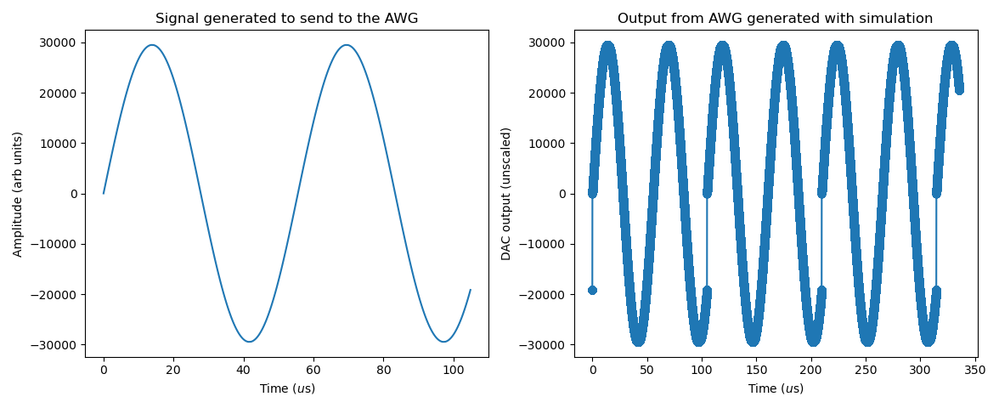

Simulation results have been added. The simulation testbench generates all the relevant input signals to the awg_rfsoc module, (as is done in the PYNQ notebook), and stores the output of the AWG DAC in a txt file. Some liberty has been taken with the various clocks rates in the simulation; refer to the testbench for details. A very simple model of the DAC was created and called in the simulation - the DAC module in principal behaves like the one on the RFSoC board. The result of the simulation is summarized in the following figure.

    

